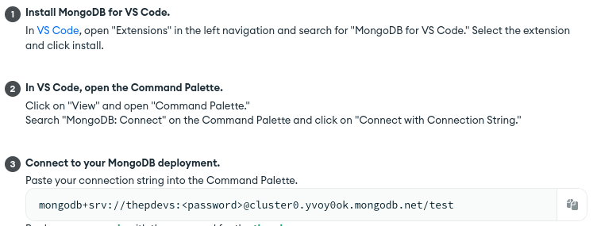

To connect to the Database, here are the following options:

-   Connect your application

    -   Here's the URL:
        -   `mongodb+srv://thepdevs:<password>@cluster0.yvoy0ok.mongodb.net/?retryWrites=true&w=majority`
    -   This is the same link that we are using in our server (NodeJS)

-   Connect using MongoDB Compass

    -   Copy the connection string, then open MongoDB Compass.
        `mongodb+srv://thepdevs:<password>@cluster0.yvoy0ok.mongodb.net/test`

-   Connect using VS Code:
    -   
        `mongodb+srv://thepdevs:<password>@cluster0.yvoy0ok.mongodb.net/test`

---

**Replace \<password\> with J9LNByQaM0S5hxHg**
